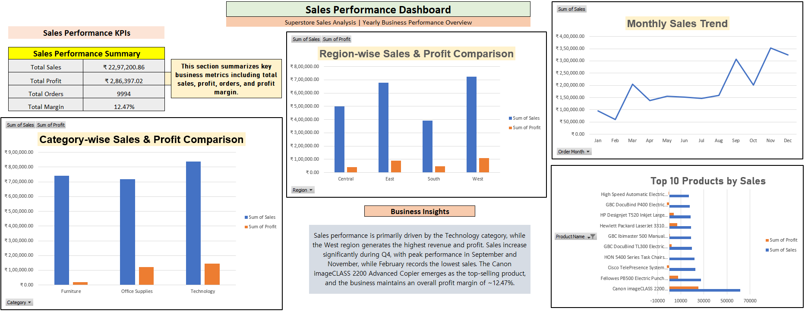

# Sales Performance Analysis Dashboard (Excel)

This project presents a complete sales performance analysis using the Superstore dataset.  
The dashboard provides insights into revenue, profit trends, regional performance, and top-selling products.

## Project Overview
This Excel dashboard analyzes yearly sales performance and highlights key business insights using interactive charts and KPI metrics.

## Key Metrics
- Total Sales
- Total Profit
- Total Orders
- Profit Margin

## Analysis Performed
- Monthly Sales Trend
- Category-wise Sales & Profit Comparison
- Region-wise Sales & Profit Analysis
- Top 10 Products by Sales

## Dashboard Preview

## Tools Used
- Microsoft Excel
- Pivot Tables
- Pivot Charts
- Data Cleaning
- KPI Metrics
- Dashboard Design

## Business Insights
- Technology category drives the highest sales.
- West region generates the highest revenue and profit.
- Sales peak during September and November.
- Canon imageCLASS 2200 Advanced Copier is the top-selling product.

## Project File
The full Excel dashboard is available in this repository.

## Author

Saranya Karthik  
Aspiring Data Analyst  
Skills: SQL | Excel | Data Analysis | Dashboarding
